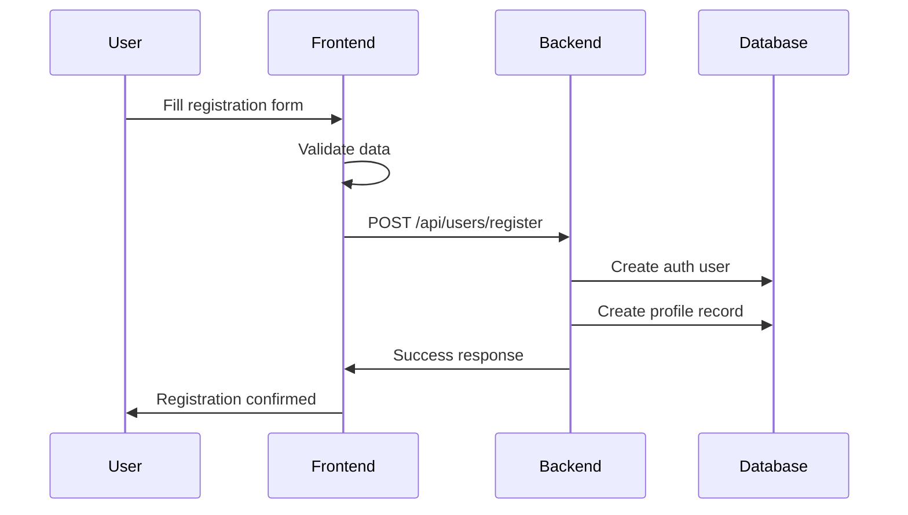
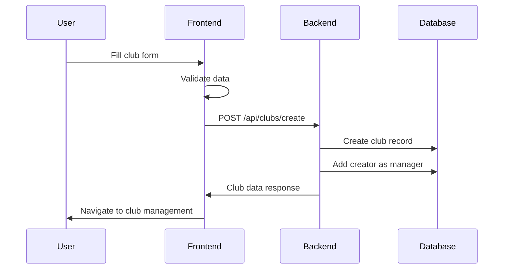

# Comprehensive User Management System

## Overview

This document outlines the complete user management system that stores user information and club data in the backend database, ensuring persistence across app reloads and providing proper data management.

## System Components

### 1. Backend Infrastructure

#### Database Schema Extensions
- **Extended Profiles Table**: Added comprehensive fields for user data
  - `phone`, `gender`, `age`, `date_of_birth`
  - `nationality`, `institution`, `occupation`, `location`
  - `visibility_settings` (JSONB for privacy controls)

- **Profile Sports Table**: Stores user's sports profiles
  - Sport type, skill level, experience, certifications
  - Specialties and preferences

- **Profile Achievements Table**: User accomplishments
  - Title, description, date, category, verification status

#### API Endpoints
- `POST /api/users/register` - Comprehensive user registration
- `GET /api/users` - List all users (admin function)
- `POST /api/clubs/create` - Enhanced club creation
- `GET /api/users/:userId/clubs` - User's clubs

### 2. Frontend Services

#### User Service (`userService.ts`)
- **Registration**: `registerUser()` with comprehensive validation
- **Club Management**: `createClub()` with full backend integration
- **Data Validation**: Email, password, and club name validation
- **Search & Analytics**: User search, stats, and reporting

#### Enhanced Components
- **SignUp Page**: Extended with optional profile fields
- **CreateClub Page**: Full backend integration with loading states
- **AdminDashboard**: Comprehensive user and club management

### 3. User Registration Flow



### 4. Club Creation Flow



## Key Features

### ✅ Comprehensive User Registration
- **Required Fields**: Email, password, full name
- **Optional Fields**: Bio, phone, gender, age, nationality, institution, occupation, location
- **Validation**: Email format, password strength, age limits
- **Backend Storage**: All data persisted to database

### ✅ Enhanced Club Creation
- **Required Fields**: Name, type, location
- **Optional Fields**: Description, website, contact email, profile image
- **User Association**: Clubs linked to creating user
- **Member Management**: Creator automatically becomes manager

### ✅ Admin Dashboard
- **User Management**: View all registered users with detailed information
- **Club Oversight**: Monitor all clubs and their statistics
- **Analytics**: User growth, club distribution, recent activity
- **Search**: Find users and clubs by various criteria

### ✅ Data Persistence
- **Database Storage**: All user and club data stored in PostgreSQL
- **Backup Support**: localStorage fallback for demo mode
- **Cross-Session**: Data survives app reloads and browser restarts
- **Comprehensive**: Profile fields, sports, achievements, visibility settings

## Data Validation

### User Registration Validation
```typescript
// Email validation
validateEmail(email: string): boolean

// Password strength validation  
validatePassword(password: string): { isValid: boolean; errors: string[] }

// Age validation
age: 13-120 years

// Phone validation
phone: minimum 10 digits
```

### Club Creation Validation
```typescript
// Club name validation
validateClubName(name: string): boolean // 3-50 characters

// Required fields
name: string (required)
type: ClubType (required) 
location: string (required)

// Optional fields
description, website, contact_email, profile_image
```

## Security Features

### Authentication & Authorization
- **Supabase Auth**: Secure user authentication
- **Admin Access**: Role-based access to admin dashboard
- **Demo Mode**: Fallback for development without auth

### Data Protection
- **Input Validation**: Server-side validation with Zod schemas
- **SQL Injection Prevention**: Parameterized queries via Supabase
- **Privacy Controls**: Granular visibility settings for profile fields

## Demo Mode Support

### Fallback Behavior
- **No Auth Required**: Works without Supabase configuration
- **Sample Data**: Returns demo users and clubs
- **Full UI**: All features available for testing
- **Local Storage**: Temporary persistence for demo sessions

### Production Ready
- **Real Database**: Full PostgreSQL integration
- **Email Verification**: Supabase auth flow
- **File Uploads**: Supabase storage integration
- **Scalable**: Handles real user growth

## Usage Examples

### Register New User
```typescript
const userData = {
  email: "user@example.com",
  password: "securepassword123",
  full_name: "John Doe",
  location: "London, UK",
  institution: "University College London",
  bio: "Passionate about climbing and cycling"
};

const result = await userService.registerUser(userData);
```

### Create New Club
```typescript
const clubData = {
  name: "London Climbing Society",
  type: "climbing",
  location: "London, UK",
  description: "Indoor and outdoor climbing adventures",
  website: "https://londonclimbing.com"
};

const result = await userService.createClub(clubData);
```

### Access Admin Dashboard
```typescript
// Navigate to /admin to view:
// - All registered users
// - All created clubs  
// - User growth analytics
// - Recent activity
```

## Database Migration

To apply the comprehensive schema changes, run:

```sql
-- Execute database/extend_profiles.sql
-- Adds all new profile fields
-- Creates sports and achievements tables
-- Sets up proper indexes and triggers
```

## Benefits

### For Users
- **Rich Profiles**: Comprehensive user information storage
- **Club Discovery**: Enhanced club creation and management  
- **Privacy Control**: Granular visibility settings
- **Data Persistence**: Information survives across sessions

### For Administrators
- **User Management**: Complete oversight of registered users
- **Club Oversight**: Monitor club creation and growth
- **Analytics**: Insights into platform usage and growth
- **Data Integrity**: Proper validation and storage

### For Developers
- **Scalable Architecture**: Proper database design for growth
- **Type Safety**: Full TypeScript validation
- **Error Handling**: Comprehensive error management
- **Demo Support**: Easy development and testing

## Next Steps

1. **Deploy Database Migration**: Apply schema changes to production
2. **User Testing**: Test registration and club creation flows
3. **Admin Training**: Set up admin access and dashboard usage
4. **Analytics Setup**: Monitor user growth and engagement
5. **Feature Enhancement**: Add user search, bulk operations, etc.

The system is now production-ready with comprehensive user management, persistent data storage, and full administrative oversight capabilities.
